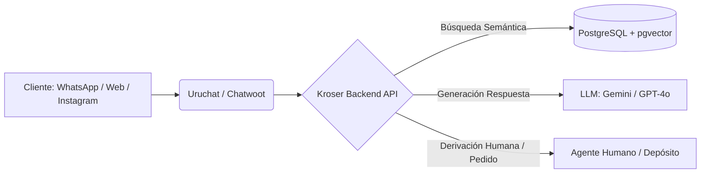
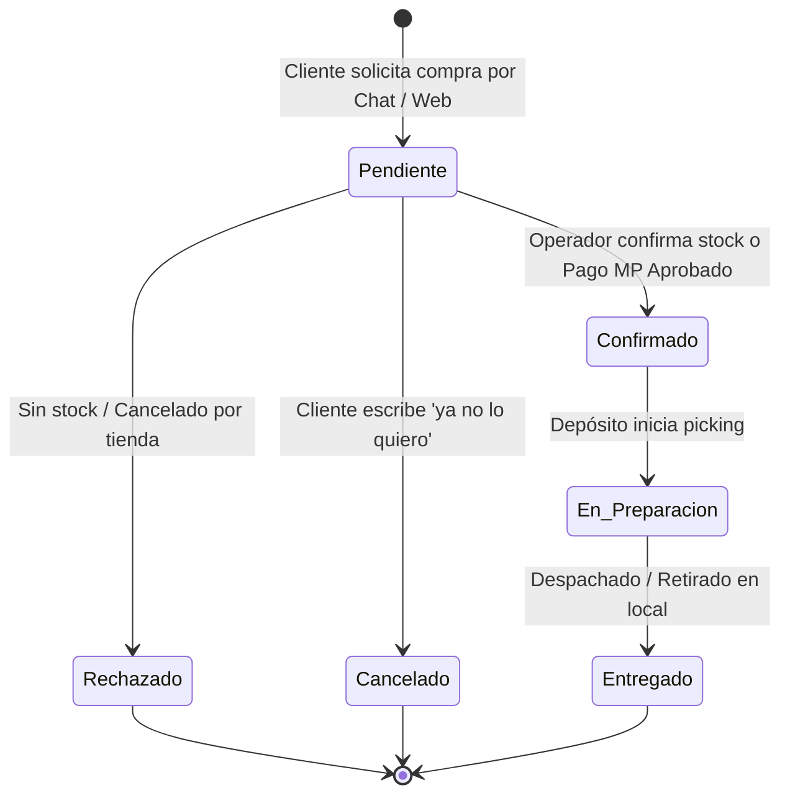

# 📘 Manual de Uso y Operación — Bot Kroser


**Sistema Integral de Inteligencia Artificial para Kroser Uruguay**  
*Atención Automatizada Multicanal • Catálogo RAG Vectorial • Gestión de Pedidos • Pasarela Mercado Pago • Panel Administrativo y de Depósito*

---

## 📑 Tabla de Contenidos

1. [Visión General del Sistema](#-1-visión-general-del-sistema)
2. [Arquitectura y Flujo de Atención](#-2-arquitectura-y-flujo-de-atención)
3. [Arranque y Despliegue con Docker](#-3-arranque-y-despliegue-con-docker)
4. [Guía del Panel de Administración](#-4-guía-del-panel-de-administración)
   - [Dashboard & Métricas](#dashboard--métricas)
   - [Prompt & Mensajes Predeterminados](#prompt--mensajes-predeterminados)
   - [Uruchat & Control de Canales (Instagram, WhatsApp, etc.)](#uruchat--control-de-canales)
   - [Estrategia de Fuente de Datos](#estrategia-de-fuente-de-datos)
   - [Conector Dinámico de Agente IA](#conector-dinámico-de-agente-ia)
   - [Control de Pedidos & Panel de Depósito](#control-de-pedidos--panel-de-depósito)
   - [Gestión de Sucursales y Envíos](#gestión-de-sucursales-y-envíos)
   - [Integración con Mercado Pago](#integración-con-mercado-pago)
   - [Control del Scraper](#control-del-scraper)
5. [Protocolo de Intervención Humana](#-5-protocolo-de-intervención-humana)
6. [Flujo de Estados de Pedidos](#-6-flujo-de-estados-de-pedidos)
7. [Solución de Problemas (Troubleshooting)](#-7-solución-de-problemas-troubleshooting)

---

## 🌟 1. Visión General del Sistema

El **Bot Kroser** es una solución enterprise diseñada para automatizar la atención a clientes, brindar recomendaciones de productos con búsqueda semántica (RAG) y gestionar pedidos de extremo a extremo para las tiendas de **Kroser Uruguay**.



### ✨ Características Principales

- 🧠 **Búsqueda Semántica RAG**: Encuentra productos exactos y alternativos en el catálogo usando embeddings vectoriales (`pgvector`).
- 🛑 **Control de Canales (Atención Humana)**: Apaga el bot selectivamente en cualquier canal (ej. Instagram) o bandeja específica para atención 100% manual.
- 🤝 **Abandono y Silenciamiento Inteligente**: Si un operador humano interviene en la conversación o se asigna la charla, el bot se retira de inmediato.
- 🤖 **Conector Multi-Modelo**: Selección en tiempo real entre Google Gemini, OpenAI o modelos compatibles desde el panel sin reiniciar el servidor.
- 🛒 **Gestión de Pedidos & Depósito**: Panel dedicado para preparación y despacho de compras de mostrador y pedidos web.
- 💳 **Mercado Pago Integrado**: Generación de links de pago y webhooks con verificación criptográfica HMAC `x-signature`.

---

## 🏗️ 2. Arquitectura y Flujo de Atención


### Ciclo de Vida del Mensaje

1. **Recepción & Debounce (~8s)**:
   - El webhook recibe el evento `message_created` desde Uruchat / Chatwoot.
   - Si el cliente envía varios mensajes seguidos, el bot los agrupa en un único contexto coherente.
2. **Escudo de Seguridad & Filtro de Canales**:
   - Descarta rebotes de correo (`mailer-daemon`) y mensajes del propio bot.
   - Verifica si el canal o bandeja (ej. *Instagram*) está configurado como **Bot Apagado (Solo Humanos)**.
   - Verifica si la conversación está asignada a un agente humano o si un operador intervino previamente (`human_active`).
3. **Búsqueda RAG (Embeddings)**:
   - Extrae el vector de la consulta del cliente y busca los productos y sucursales más relevantes.
4. **Respuesta del Modelo & Acciones**:
   - Genera respuesta amigable con venta cruzada y stock.
   - Si detecta intención de compra, inicia la toma de datos de pedido.
   - Si responde con `DERIVAR: [AREA]`, asigna al operador en Chatwoot, notifica por correo y guarda silencio.

---

## 🚀 3. Arranque y Despliegue con Docker

### Requisitos
- **Docker Engine** 24+ y **Docker Compose**
- Archivo `.env` configurado con las credenciales locales

### 1. Variables de Entorno (`.env`)
```bash
cp .env.example .env
```
Configura los valores principales:
```env
PORT=3000
POSTGRES_USER=kroser
POSTGRES_PASSWORD=kroser
POSTGRES_DB=kroserbot
REDIS_HOST=redis
REDIS_PORT=6379
JWT_SECRET=tu_secreto_super_seguro_min_32_caracteres
ADMIN_USER=admin
ADMIN_PASSWORD=TuPasswordSeguro123!
CHATWOOT_BASE_URL=https://app.uruchat.com
CHATWOOT_API_TOKEN=tu_token_de_uruchat
GEMINI_API_KEY=AIzaSy...
OPENAI_API_KEY=sk-proj-...
MERCADOPAGO_ACCESS_TOKEN=APP_USR-...
```

### 2. Levantar la Infraestructura
```bash
docker compose up -d
```

### 3. Verificar Servicios Activos
```bash
docker compose ps
```
- **Postgres (pgvector)**: Puerto `5432`
- **Redis**: Puerto `6379`
- **Backend & Panel Admin**: `http://localhost:3000/admin`

---

## 🖥️ 4. Guía del Panel de Administración


Acceso: `http://localhost:3000/admin` (o dominio de producción).

---

### 📊 Dashboard & Métricas
- **Total de Pedidos**: Contador acumulado de pedidos recibidos.
- **Productos en Catálogo**: Cantidad de artículos activos e indexados con vectores.
- **Derivaciones a Humano**: Estadísticas de transferencias a operadores por área.

---

### 📝 Prompt & Mensajes Predeterminados
Permite modificar en caliente las instrucciones del bot sin tocar código:
- **System Prompt**: Rol del bot, tono de voz y reglas de negocio.
- **Mensajes Automáticos**:
  - `msg_pedido_pendiente`: Aviso cuando el pedido pasa a revisión humana.
  - `msg_pedido_listo`: Notificación cuando el operador confirma el pedido.
  - `msg_pedido_rechazado`: Aviso de falta de stock o cancelación.
  - `msg_derivacion`: Texto al transferir con un asesor.

---

### 🔌 Uruchat & Control de Canales (Instagram, WhatsApp, etc.)

> [!IMPORTANT]
> **Apagar el Bot por Canal / Inbox para Atención 100% Humana**:
> En esta pestaña puedes activar el switch **"Apagar Bot (Solo Humanos)"** en canales específicos.
> - 📸 **Instagram**: Marca la casilla si deseas que los DMs y comentarios de Instagram sean atendidos únicamente por tus asesores.
> - 💬 **WhatsApp**: Control independiente para tus líneas de WhatsApp.
> - 🌐 **Web Widget**: Chat del sitio web.
> - ✉️ **Email / Facebook / Telegram**: Control individual por plataforma.
> - **Inboxes Personalizados**: Campo para ingresar IDs numéricos o nombres de bandejas específicas.

Haz clic en **"💾 Guardar Control de Canales"** para aplicar los cambios de inmediato.

---

### 🗄️ Estrategia de Fuente de Datos
Selecciona cómo se mantiene actualizado el catálogo:
1. **Web Scraping**: Extracción diaria automática de `kroser.com.uy` (sitemap XML + HTML).
2. **Conector SQL Directo**: Conexión de solo lectura a la base de datos ERP de Kroser.
3. **API REST Externa**: Ingestión mediante endpoint JSON con autenticación Bearer.

---

### 🤖 Conector Dinámico de Agente IA
Permite alternar entre proveedores de Inteligencia Artificial:
- **Google Gemini**: Modelos `gemini-1.5-flash`, `gemini-1.5-pro`, `gemini-2.0-flash`.
- **OpenAI**: Modelos `gpt-4o`, `gpt-4o-mini`, `gpt-3.5-turbo`.
- **OpenAI-Compatible**: Servidores locales o proxies (Groq, Together AI, Ollama, DeepSeek).

---

### 🛒 Control de Pedidos & Panel de Depósito
- **Vista Administrativa**: Tabla completa de pedidos con filtros por estado (`pendiente`, `confirmado`, `en_preparacion`, `rechazado`, `cancelado`, `entregado`).
- **Panel de Depósito ([/admin/deposito.html](file:///c:/Users/usuario/Desktop/kroserbot/admin/deposito.html))**: Vista optimizada para operadores de depósito para imprimir hojas de picking, empaquetar y marcar pedidos listos para despacho.

---

### 🏪 Gestión de Sucursales y Envíos
- **Sucursales (Locales)**: Administra direcciones, teléfonos, horarios de atención y zonas de los 50+ locales de Kroser en todo el país.
- **Zonas de Envío**: Configura costos de envío a domicilio por departamento y localidad (Montevideo, Canelones, Interior, etc.).

---

### 💳 Integración con Mercado Pago
- **Checkout Pro**: Generación automática de botones y enlaces de pago para carritos de compra.
- **Webhooks con Firma Criptográfica**: Validación de autenticidad en tiempo real mediante cabecera `x-signature` para evitar fraudes.
- **Auto-Confirmación**: Opción para marcar automáticamente los pedidos como `confirmado` al recibir la aprobación de pago de Mercado Pago.

---

### 🕷️ Control del Scraper
- Visualiza el estado de la última corrida, productos nuevos agregados, actualizados y bajas.
- Botón **"Iniciar Scraping Manual"** para sincronizar el catálogo al instante.

---

## 🤝 5. Protocolo de Intervención Humana

El bot cuenta con un sistema de **abandono automático** para evitar interferir con los agentes humanos:

| Evento | Comportamiento del Bot |
| :--- | :--- |
| **Operador responde en Uruchat** | El bot detecta `sender.type: agent`, cancela su debounce y activa el silencio (`human_active`). |
| **Cliente vuelve a escribir** | El bot detecta que hay un humano activo en la charla y **no responde**. |
| **Conversación con `assignee_id`** | El bot ignora cualquier mensaje en conversaciones asignadas a un humano. |
| **Bot deriva (`DERIVAR:`)** | Asigna al operador en Uruchat, envía correo interno y queda en silencio. |
| **Conversación desasignada** | Al liberar la conversación (`assignee_id: null`), el bot se reactiva automáticamente. |

---

## 🔄 6. Flujo de Estados de Pedidos



---

## 🛠️ 7. Solución de Problemas (Troubleshooting)

### ❓ El bot responde en un canal que debe ser 100% humano
- Ve al panel admin en la pestaña **🔌 Uruchat Integración**.
- Verifica que el canal (ej. *Instagram*) tenga la casilla **"Apagar Bot"** marcada y el badge muestre `🔴 Bot Apagado`.
- Haz clic en **"💾 Guardar Control de Canales"**.

### ❓ El bot no responde a los clientes en WhatsApp o Web
- Revisa que el webhook en Uruchat esté apuntando a: `https://tu-dominio.com/api/webhook`.
- Comprueba que la conversación no tenga asignado un agente humano o esté en estado `human_active`.
- Verifica el estado de salud del backend en `http://localhost:3000/api/health`.

### ❓ Error de conexión con la Base de Datos o Redis
- Ejecuta `docker compose ps` para comprobar que `kroserbot-postgres` y `kroserbot-redis` estén en estado `healthy`.
- Si las tablas no existen, corre las migraciones: `npm run migrate:up`.

---

**Kroser Uruguay — 2026** • *Bot Kroser AI Architecture*
